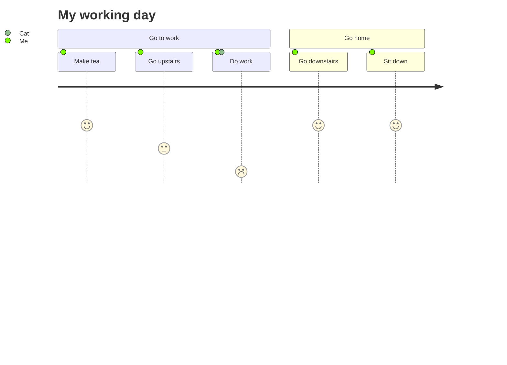

自用，新功能测试

<!-- more -->

## 组件库

### note



```javascript 

```

### quot



```js 

```

### folders



<!-- folder 吃饭时停电为什么扒拉两口饭灯就会亮？ -->

因为巴啦啦能量。

<!-- folder 小王剪了中分会变成什么？-->

小全

<!-- folder 狐狸为什么站不起来？-->

因为他狡猾(脚滑)/骚断腿

<!-- folder 许仙给老婆买了一顶帽子，白娘子戴上之后，为什么感觉头特别重? -->

因为那是鸭舌帽

<!-- folder 青蛙吃了什么就会变哑巴?-->

南瓜(难呱)



```js 

<!-- folder 吃饭时停电为什么扒拉两口饭灯就会亮？ -->

```

### emoji

```js 
 你猜对了吗？
```

 你猜对了吗？

### hashtag



```js 

```

### image



```js  

```

### icons.yml

```



```





### button





```js 


```

### OKR



2024年的小目标：完成 Volantis 6.0 并发布上线
来自2025年的复盘：已《基本》实现目标 

<!-- okr kr1 percent:1 -->
重构 tag-plugins 和 wiki 系统

- 当  进度为 100% 时，标签默认显示为 
- 当  未设置进度时，默认为 {% mark 0% %}
- 当  未设置进度时，则显示所有  进度平均值

<!-- okr kr2 percent:0.9 status:off_track -->
完成主要页面设计稿

<!-- tab 小提示1 -->
您可以在 _config.yml 文件中修改标签的颜色和文案
<!-- tab 小提示2 -->
您可以在 _config.yml 文件中增加任意的标签配置


<!-- okr kr3 percent:-0.12 status:unfinished -->
完成前置准备工作（如果你知道答案，请在留言区帮帮我！🥹）





<!-- okr kr-4 status:at_risk -->
开发、测试和发布









学无止境，每年至少完成两个兴趣爱好的挖掘和开拓，同时产出该爱好相关的作品。

<!-- okr kr1 percent:0.5 status:at_risk -->

个人博客：完成因版本更新导致的遗留问题和历史版本迁移

1.  : 每次主题更新，更改时间周期不超过 5Days。

2.  ：在保持日常更新频率的同时，完成其余板块的更新

- 完成 wiki-系统、笔记-模块、about 界面的配置更新|内容重组|界面美化。

- 完成 chatgpt 板块完善、前端板块持续输出不少于 10 篇。

<!-- okr kr2 percent:0.2 status:unfinished -->

个人技能：持续学习全栈开发，全面提升个人技术能力。

1.  ：完成学习并完成个人网页的开发。
2.  ：与前端联合，完成一个自动化网页商城的搭建。

<!-- okr kr3 percent:0 status:unfinished -->

娱乐活动：学习数位板的使用，搭配 blender 模型设计并完成一个人物建模。



###  Copy







```js 





```

### radio




```js 


```

### checkbox







```js 





```

### audio





```js 





```

### video

{% video bilibili:BV1NV4y1L79y width:100% autoplay:0 %}


<!-- cell -->

<!-- cell -->
{% video https://github.com/volantis-x/volantis-docs/releases/download/assets/IMG_0341.mov width:100% %}


### navbar


```js  

```

### psw/u/emp/wavy/del/sup/sub/kbd

> 这是  标签
>
> 这是  标签
>
> 这是  标签
>
> 这是  标签
>
> 这是  标签
>
> 这是  标签
>
> 这是  标签
>
> 这是  标签，试一试： + 

```js 
- 这是  标签
- 这是  标签
- 这是  标签
- 这是  标签
- 这是  标签
- 这是  标签
- 这是  标签
- 这是  标签，试一试： + 
```

## Timeline时间线


<!-- node 2024 年 1 月 1 日 -->
新年快乐。🐾😸

<!-- node 2024 年 2 月 6 日 -->
回家过年，新的一年，新的成长。

<!-- node 2024 年 12 月 12 日 -->

这是一个预言说说。🈲



## 在目录树中隐藏某篇文章

可以在 `front-matter` 中不设置 `title` 标题，或者将 `title` 改为 `seo_title`。

```js /blog/source/xxx/xxx.md
title: ''
seo_title:标题
```

## ghcard 卡片




```


```


## Tabs 分栏器



<!-- tab 图片test -->


<!-- tab 代码块test -->

```swift
let x = 123
print("hello world")
```

<!-- tab 文字test -->
这是一个测试。Test it 😸🐾



## grid 网格分区容器


<!-- cell -->
阿尔贝·加缪（1913—1960年），法国声名卓著的小说家、散文家和剧作家，存在主义文学大师，“荒诞哲学”的代表人物。
<!-- cell -->
不要走在我后面，因为我可能不会引路；不要走在我前面，因为我可能不会跟随；请走在我的身边，做我的朋友。
<!-- cell -->
我们很少信任比我们好的人，宁肯避免与他们来往。相反，我们常对与我们相似、和我们有着共同弱点的人吐露心迹。我们并不希望改掉弱点，只希望受到怜悯与鼓励。
<!-- cell -->
真正的救赎，并不是厮杀后的胜利，而是能在苦难之中找到生的力量和心的安宁。


## swiper 轮播容器

默认一张图片是 50% 宽度，通过设置 `width:min` 设置为 25% 宽度，`width:max` 设置为 100% 宽度。effect:cards/coverflow.







```




```

## katex 插件

$$\sum_{i=0}^n i^2 = \frac{(n^2+n)(2n+1)}{6}$$

## mathjax 插件

$$\sum_{i=0}^n i^2 = \frac{(n^2+n)(2n+1)}{6}$$

## 图表类插件




## Post文章问题

### 文章如何置顶？

在`front-matter`配置`sticky: 数字序号`。


### 删除顶部导航

在`front-matter`配置`breadcrumb: false`


### 不显示文章标题

在`front-matter`配置`h1: ''` 将一级标题置空。


## paper标签

<!-- line left-->
见字如面。
<!-- line right-->
见字如面。
<!-- paragraph -->
心是一座孤岛，即便岛上繁花似锦，四季更替，依然只是一个人的风景。繁华也好，萧条也好，都只属于一个人。记得有人说过这样一句话：一人花开，一人花落，这些年从头到尾，无人问询。那种寥落，如轩窗外的一片月色，独自在树梢起舞，却无人欣赏它清丽的舞姿。又像是一阙小词，笔笔皆清冷，笔笔皆寂寥。
<!-- section 抓到一名同学 -->
欢迎留言哦！
<!-- paragraph -->
好的，一定会的！



<!-- line left--> 
❄️字迹已经模糊,因为思念的缘故.
❄️我从没被谁知道,所以也没被谁忘记.在别人的回忆中生活,并不是我的目的.
❄️画下丘陵——长满淡淡的茸毛,我让它们挨得很近,让它们相爱,让每一个默许,每一阵静静的春天的激动,都成为一朵小花的生日.
❄️树枝想去撕裂天空,却只戳了几个微小的窟窿,它透出了天外的光亮,人们把它叫做月亮和星星.
❄️种子在冻土里梦想春天。
❄️路是这样窄吗？只是一脉田埂。拥攘而沉默的苜蓿，禁止并肩而行。如果你跟我走，你会数我的脚印；如果我随你去，只能看你的背影。

>
❄️人生两件幸事，思想自由，行动自由。 
❄️唯有承认了孤独的必然，才能享受不从众的自在，有多少孤独就有多少真实。 
❄️一个人能够追求的最高理想就是自我的完善。 
❄️一颗石子扔到河里，整个宇宙就会变得和原来不同。 
❄️你终究会成为你正在成为的人，你的每一个选择都是来自你人生意义的诘问。 
❄️剃刀锋利，越之不易；智者有云，得渡人稀。 


